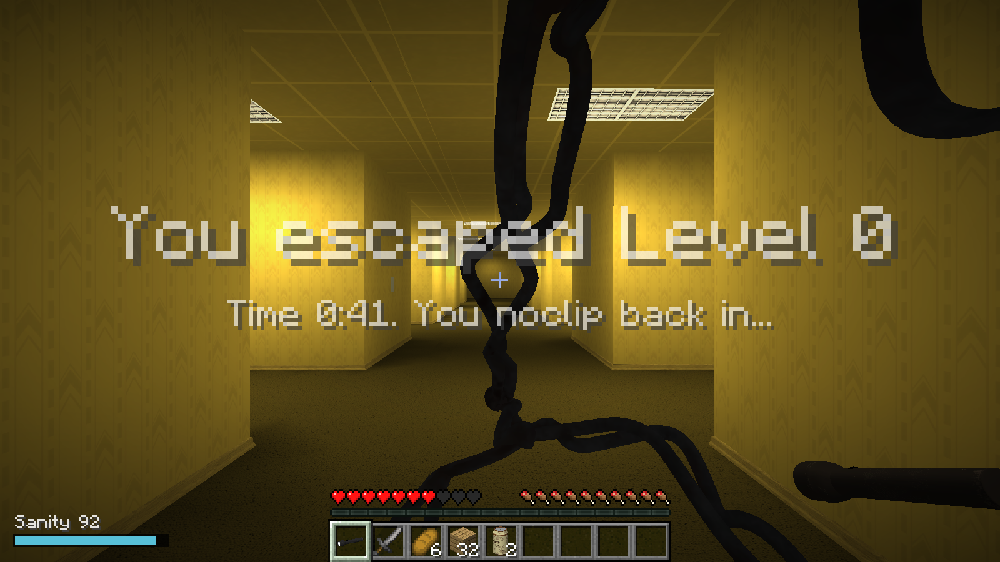

# Steve in the Backrooms

**El Level 0 real de [Escape the Backrooms](https://store.steampowered.com/app/1943950/Escape_the_Backrooms/), jugado como Steve de Minecraft. El mapa, las texturas, los sonidos, la Bacteria, la linterna y el agua de almendras se leen de tu propia copia del juego.**

*Escape the Backrooms' real Level 0, played as Minecraft's Steve. [English below](#english).*

## De qué va

Arrancas Minecraft y apareces en uno de los puntos de inicio reales del Level 0. Tienes que encontrar la salida del nivel mientras la Bacteria te busca.

- **Todo lo que rodea a Steve es Escape the Backrooms.** El mapa completo del Level 0 con su geometría, su papel pintado, su moqueta, sus techos y sus muebles, iluminado por las lámparas del propio mapa. No hay bloques: se dibujan las mallas reales. El mod no incluye ningún archivo del juego.
- **Steve y sus cosas son Minecraft.** El personaje, la vida, el hambre, el inventario, la barra de objetos, el combate y poner bloques. Puedes tapar un pasillo con tablones o pelear con la espada.
- **La Bacteria.** Su modelo y sus animaciones de reposo, carrera y ataque son los del juego. Sigue el rastro por donde has pasado y te persigue cuando te ve.
- **Linterna y agua de almendras.** Los modelos reales. La linterna (clic derecho) ilumina el mapa; el agua de almendras recupera cordura.
- **Cordura.** Baja poco a poco, más rápido a oscuras sin linterna y cuando la Bacteria te persigue de cerca. A cero, hace daño.
- **La salida.** El conducto de ventilación real del Level 0. Al llegar termina la partida y empiezas otra.

| El nivel | La Bacteria | La salida |
|---|---|---|
|  |  |  |

## Qué necesitas

- **Minecraft: Java Edition** (una cuenta de Microsoft que lo tenga).
- **Escape the Backrooms instalado en Steam.** Sin él, el juego te avisa en pantalla y no hay nivel.
- Windows.

## Cómo se instala

**La forma fácil: [Melty](https://melty.gg/m/steve-in-the-backrooms).** Pulsa Play. La primera vez se abre Prism Launcher para que inicies sesión con tu cuenta de Microsoft; después descarga Minecraft y Java solo y arranca el juego.

**A mano**, en tu propio launcher:

1. Crea una instalación de Minecraft **1.21.11** con **Fabric Loader 0.19.5** o posterior.
2. Descarga `backroomscraft-<versión>.jar` de [Releases](../../releases) y ponlo en la carpeta `mods` junto con [Fabric API](https://modrinth.com/mod/fabric-api) para 1.21.11.
3. Arranca el juego.

## Cómo se juega

Crea un mundo de un jugador en Supervivencia. La primera vez el mod construye el Level 0 a partir de tu copia del juego (unos segundos) y te lleva a él.

| Control | Qué hace |
|---|---|
| Clic derecho con la linterna | Encenderla o apagarla |
| Clic derecho con el agua de almendras | Beberla |
| Lo demás | Como en Minecraft |

Empiezas con la linterna, una espada de piedra, pan, 32 tablones y dos latas de agua de almendras. En el mapa hay más latas y otra linterna donde las tiene el juego original.

## Estado y límites

Versión 0.1.0: un jugador, Level 0.

- La luz la calcula el mod a partir de las lámparas del mapa; no es la iluminación de Unreal.
- El comportamiento de la Bacteria es del mod. En el mapa original está encerrada hasta un evento; aquí aparece sobre el rastro por donde has pasado.
- Los puzles del Level 0 (escalera, llaves, notas) no están: solo hay que llegar a la salida.
- Los materiales transparentes (cristal, niebla) no se dibujan.
- Cada vez que entras al mundo empieza una partida nueva con el equipo inicial.
- Probado con una prueba automática dentro del juego desde los cuatro puntos de inicio. Aún falta comprobar a mano los sonidos de oído, la pérdida de cordura a oscuras y el mensaje cuando el juego no está instalado.

## Cómo está hecho

- `mod/`: el mod de Fabric (Java). `etb/` lee el `.pak` del juego (mapas, mallas, texturas, materiales, sonidos, esqueletos, animaciones); `bake/` convierte el mapa en mallas con luz y en colisión de 12,5 cm; `client/` lo dibuja con su propio shader.
- `design/sheets/`: hojas JSON con todo el diseño. Son la fuente de verdad; `python design/sheets.py gen` las comprueba y genera código.
- `recon/`: los scripts con los que se estudiaron los archivos del juego.
- `package.py` y `melty.json`: el paquete y la receta para Melty.
- `media/steve_in_the_backrooms_demo.mp4`: vídeo de 28 s grabado del juego (`gradlew runClient -Pautotest=demo`).
- [docs/development.md](docs/development.md): cómo compilar y probar.

## Créditos y licencia

Código bajo licencia [MIT](LICENSE). Terceros: [THIRD_PARTY_NOTICES.md](THIRD_PARTY_NOTICES.md).

- Hecho con ayuda de IA (Claude) y el kit [universal-modder](https://github.com/rehan-remade/universal-modder).
- La organización del repositorio sigue la de [Minecraft Ring](https://github.com/siddoff/Minecraft-Ring).

Escape the Backrooms es de Fancy Games y Minecraft es de Mojang/Microsoft. Este proyecto no está afiliado a ninguno de ellos y no distribuye contenido de ninguno de los dos juegos.

---

## English

Steve in the Backrooms (mod id `backroomscraft`) puts you, as Minecraft's Steve, in the real Level 0 of Escape the Backrooms: the whole map with its own geometry, textures, lamps and sounds, the Bacteria with its model and animations, the flashlight and the almond water, all read from your own copy of the game while Minecraft runs. Nothing of the game ships with the mod, and there are no blocks standing in for the level.

Steve, the HUD, health, hunger, the inventory, combat and placing blocks are Minecraft's. Find the level's exit vent while the Bacteria follows your trail; sanity drains in the dark and during a chase, and almond water restores it.

**You need** Minecraft: Java Edition, Escape the Backrooms installed on Steam, and Windows.

**Install:** press Play on [Melty](https://melty.gg/m/steve-in-the-backrooms), or put the jar from [Releases](../../releases) and Fabric API into the `mods` folder of a Minecraft 1.21.11 + Fabric Loader install. Create a single-player Survival world.

**Limits (0.1.0):** single player, Level 0 only; the lighting is the mod's own, baked from the map's lamps; the Bacteria's behaviour is the mod's; the level's puzzles and see-through materials are not there.

MIT licensed. Not affiliated with Fancy Games, Mojang or Microsoft.
