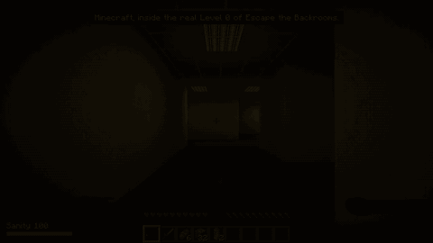
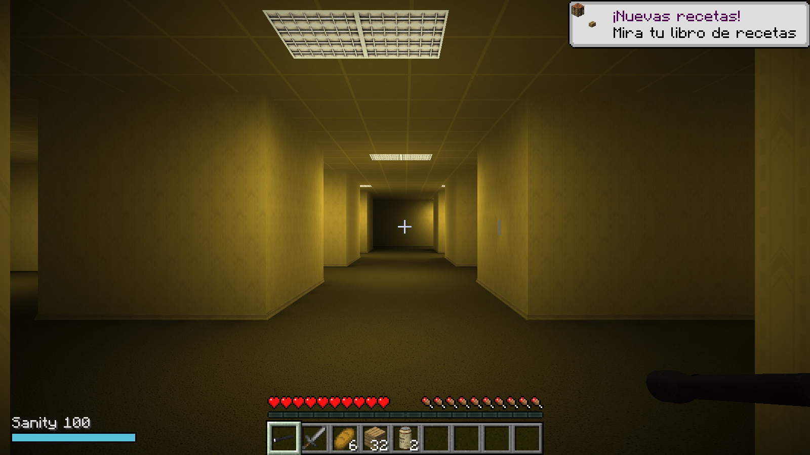
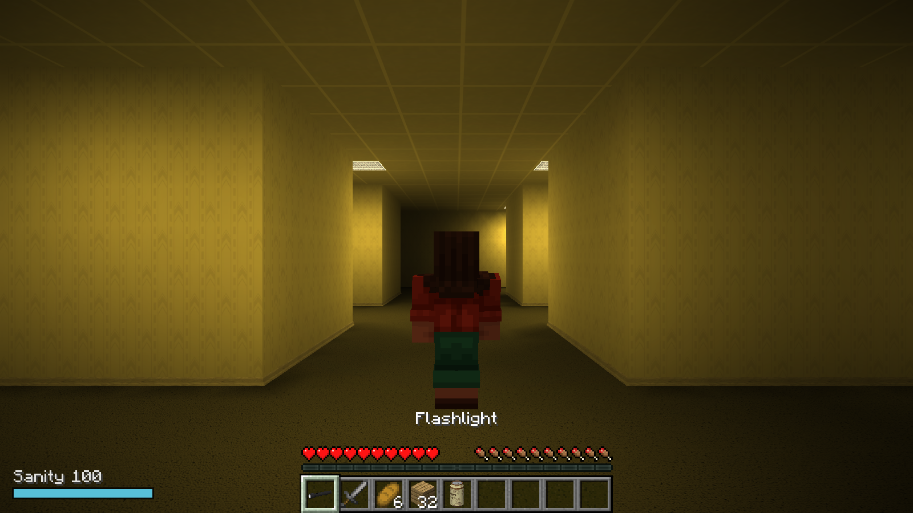
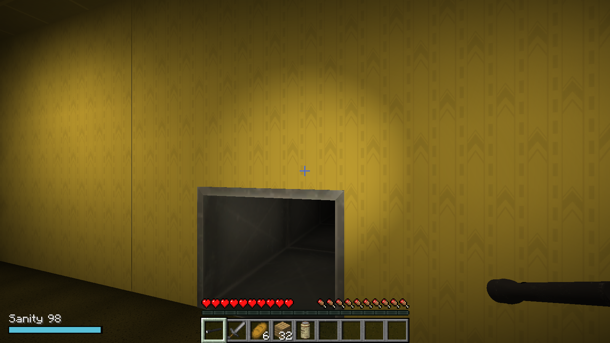

<h1 align="center">Steve in the Backrooms</h1>

  <b>Minecraft dentro del Level 0 real de Escape the Backrooms.</b> 
  Sin cubos: el mapa, las texturas, los sonidos, la Bacteria, la linterna y el agua de almendras se leen de tu propia copia
  de <a href="https://store.steampowered.com/app/1943950/Escape_the_Backrooms/">Escape the Backrooms</a> mientras juegas.
  Steve, su inventario y sus bloques son de Minecraft.

  
  
  
  
  

  

<i>English summary <a href="#english">below</a>. Vídeo completo: <a href="media/steve_in_the_backrooms_demo.mp4">media/steve_in_the_backrooms_demo.mp4</a>.</i>

## Instalar

| Cómo | Pasos |
|---|---|
| **Melty** (un clic) | Pulsa Play en [melty.gg/m/steve-in-the-backrooms](https://melty.gg/m/steve-in-the-backrooms). La primera vez se abre Prism Launcher para que inicies sesión con tu cuenta de Microsoft; después descarga Minecraft y Java solo. |
| **A mano** | Instalación de Minecraft **1.21.11** con **Fabric Loader 0.19** o posterior. En `mods`: `backroomscraft-<versión>.jar` de [Releases](../../releases) y [Fabric API](https://modrinth.com/mod/fabric-api) para 1.21.11. Pasos para cada launcher [más abajo](#en-tu-launcher). |
| **Desde el código** | `cd mod` y `gradlew build`. Ver [docs/development.md](docs/development.md). |

### Qué necesitas

- **Minecraft: Java Edition** (una cuenta de Microsoft que lo tenga).
- **Escape the Backrooms instalado en Steam.** Sin él, el juego te avisa en pantalla y no hay nivel.
- Windows.

### En tu launcher

El mod es un solo archivo, [`backroomscraft-0.1.0.jar`](../../releases/latest), y sirve en cualquier launcher que tenga Fabric. Necesita Minecraft **1.21.11**, **Fabric Loader 0.19 o posterior** y el mod **Fabric API**.

| Launcher | Pasos |
|---|---|
| **CurseForge** | *Create Custom Profile* con Minecraft 1.21.11 y Fabric. En el perfil, *Add More Content* e instala **Fabric API**. Después, los tres puntos del perfil, *Open Folder*, y copia el `.jar` en la carpeta `mods`. |
| **Modrinth App** | Crea una instancia con Fabric y 1.21.11. Instala **Fabric API** desde el buscador y arrastra el `.jar` a la lista de mods de la instancia. |
| **Prism Launcher / MultiMC** | Instancia nueva de 1.21.11, *Editar*, *Versión*, *Instalar Fabric*. En *Mods*, descarga **Fabric API** y pulsa *Añadir archivo* para el `.jar`. |
| **Launcher oficial** | Instala Fabric con el [instalador de Fabric](https://fabricmc.net/use/installer/) para 1.21.11. Copia el `.jar` y el de [Fabric API](https://modrinth.com/mod/fabric-api) en `%APPDATA%\.minecraft\mods`. |

El mod todavía no está publicado en CurseForge ni en Modrinth, así que no sale en el buscador de esos launchers: el `.jar` se añade a mano como se indica arriba.

## Pruébalo

Crea un mundo de un jugador en Supervivencia. La primera vez el mod construye el Level 0 a partir de tu copia del juego (unos segundos) y te lleva a uno de sus puntos de inicio reales.

1. Mira alrededor: es el mapa del juego, con sus lámparas y su moqueta.
2. Clic derecho con la **linterna** para encenderla.
3. Clic derecho con el **agua de almendras** para recuperar cordura.
4. Cuando aparezca la **Bacteria**, corre, tapa el pasillo con tablones o pelea.
5. Encuentra el **conducto de ventilación**: es la salida real del nivel y termina la partida.

Empiezas con la linterna, una espada de piedra, pan, 32 tablones y dos latas de agua de almendras.

## Qué pone cada juego

| De Escape the Backrooms (leído de tu copia) | De Minecraft |
|---|---|
| El Level 0 completo: geometría, texturas, muebles | Steve y su movimiento |
| Las lámparas del mapa, de las que sale la luz | Vida, hambre y la barra de objetos |
| La Bacteria: modelo y animaciones de reposo, carrera y ataque | Inventario y combate |
| Linterna y agua de almendras: sus modelos | Poner bloques |
| Ambiente del nivel, pasos sobre moqueta, sonidos de persecución | El mundo, el guardado y los controles |
| Los puntos de inicio, los objetos colocados y la salida | |

| El nivel | En tercera persona | La salida |
|---|---|---|
|  |  |  |

## Qué hay dentro

| Carpeta | Qué es |
|---|---|
| [`mod/`](mod) | El mod de Fabric (Java). `etb/` lee el `.pak` del juego; `bake/` convierte el mapa en mallas con luz y en colisión de 12,5 cm; `client/` lo dibuja con su propio shader. |
| [`design/sheets/`](design/sheets) | Hojas JSON con todo el diseño: niveles, entidad, objetos, sonidos, reglas, render, equipo, textos, sistemas y enganches. Son la fuente de verdad. |
| [`recon/`](recon) | Los scripts con los que se estudiaron los archivos del juego. |
| [`docs/`](docs) | [Cómo compilar y probar](docs/development.md) y la [nota de campo](docs/field-note.md): ruta elegida, cómo funciona el juego por dentro y cada problema encontrado. |
| [`media/`](media) | Capturas y vídeo, todos grabados del juego real. |
| `package.py`, `melty.json` | El paquete y la receta de instalación para Melty. |

Cómo funciona, en orden:

1. encuentra tu copia de Steam de Escape the Backrooms;
2. lee el mapa del Level 0 y sus subniveles del `.pak`;
3. coloca cada malla en su sitio y calcula la luz de las lámparas del mapa;
4. convierte la geometría en colisión para que Minecraft camine sobre ella;
5. guarda el resultado en una caché de tu instancia (nunca en el mod);
6. dibuja el nivel, la Bacteria y los objetos mientras juegas.

## Reglas que sigue

- **No incluye ni distribuye archivos de Escape the Backrooms.** Ni el repositorio, ni el `.jar`, ni el paquete de Melty. Todo se lee de la copia instalada en tu PC.
- **Solo lee.** No abre, modifica ni parchea Escape the Backrooms. El juego no tiene anti-cheat y el mod no lo toca.
- **Lo que no se puede leer se dice, no se imita.** Los formatos que el lector no conoce se rechazan con un aviso en el registro; no hay sustitutos parecidos.
- **Probado en el juego real.** Cada fila de las hojas de diseño dice cómo se comprobó, o que sigue pendiente.

## Estado y límites

Versión 0.1.0: un jugador, Level 0.

- La luz la calcula el mod a partir de las lámparas del mapa; no es la iluminación de Unreal.
- El comportamiento de la Bacteria es del mod. En el mapa original está encerrada hasta un evento; aquí aparece sobre el rastro por donde has pasado.
- Los puzles del Level 0 (escalera, llaves, notas) no están: solo hay que llegar a la salida.
- Los materiales transparentes (cristal, niebla) no se dibujan.
- Cada vez que entras al mundo empieza una partida nueva con el equipo inicial.
- La prueba automática dentro del juego pasa desde los cuatro puntos de inicio. Falta comprobar a mano: los sonidos de oído, la pérdida de cordura a oscuras y el aviso cuando el juego no está instalado.

## Créditos

- Código bajo licencia [MIT](LICENSE). Terceros: [THIRD_PARTY_NOTICES.md](THIRD_PARTY_NOTICES.md).
- Hecho con ayuda de IA (Claude) y el kit [universal-modder](https://github.com/rehan-remade/universal-modder), cuya forma de presentar un mod sigue este repositorio.
- La organización de carpetas sigue la de [Minecraft Ring](https://github.com/siddoff/Minecraft-Ring).
- [Fabric](https://fabricmc.net/) y [Prism Launcher](https://prismlauncher.org/), incluidos en el paquete de Melty.

Escape the Backrooms es de Fancy Games y Minecraft es de Mojang/Microsoft. Proyecto de fans no oficial, sin afiliación con ninguno de ellos.

---

## English

**Minecraft inside the real Level 0 of Escape the Backrooms.** The whole map with its own geometry, textures, lamps and sounds, the Bacteria with its model and animations, the flashlight and the almond water are read from your own copy of the game while Minecraft runs. Nothing of the game ships with the mod, and there are no blocks standing in for the level. Steve, the HUD, health, hunger, the inventory, combat and placing blocks are Minecraft's.

- **Install:** press Play on [Melty](https://melty.gg/m/steve-in-the-backrooms), or put the jar from [Releases](../../releases) and Fabric API into the `mods` folder of a Minecraft 1.21.11 + Fabric Loader install. Any launcher with Fabric works (CurseForge, Modrinth App, Prism Launcher, the official one): make a 1.21.11 Fabric profile, add Fabric API, drop the jar in its `mods` folder. The mod is not listed on CurseForge or Modrinth yet.
- **You need:** Minecraft: Java Edition, Escape the Backrooms installed on Steam, Windows.
- **Play:** create a single-player Survival world. Right click with the flashlight or the almond water. Find the level's exit vent before the Bacteria finds you.
- **Limits (0.1.0):** single player, Level 0 only; the lighting and the Bacteria's behaviour are the mod's own; the level's puzzles and see-through materials are not there.
- **How it was made, and every gotcha:** [docs/field-note.md](docs/field-note.md).

MIT licensed. Unofficial fan project, not affiliated with Fancy Games, Mojang or Microsoft.
